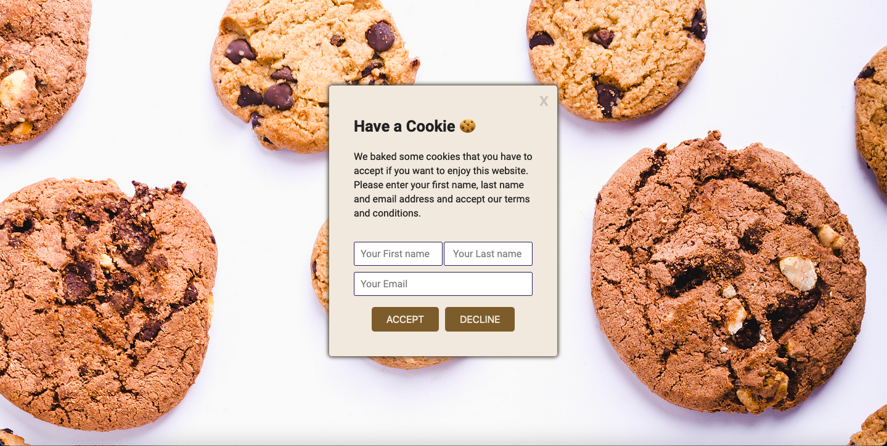

# Cookie Consent Banner

Project for Scrimba's Front-End Developer Career Path where we built a Cookie Consent Banner with HTML, CSS, and Javascript.
https://www.scrimba.com

##

## Built with:

  

 
## Preview

## Video

https://github.com/dev-evelin/cookie-consent-banner/assets/107203586/d4ee84ff-1372-480f-b571-71f2bad107a0

## Links

- Live Site URL: <a href="https://dev-evelin-cookie-consent.netlify.app/" target="_blank">https://dev-evelin-cookie-consent.netlify.app/</a>

## Connect with me::

https://www.linkedin.com/in/dev-evelin/

 
